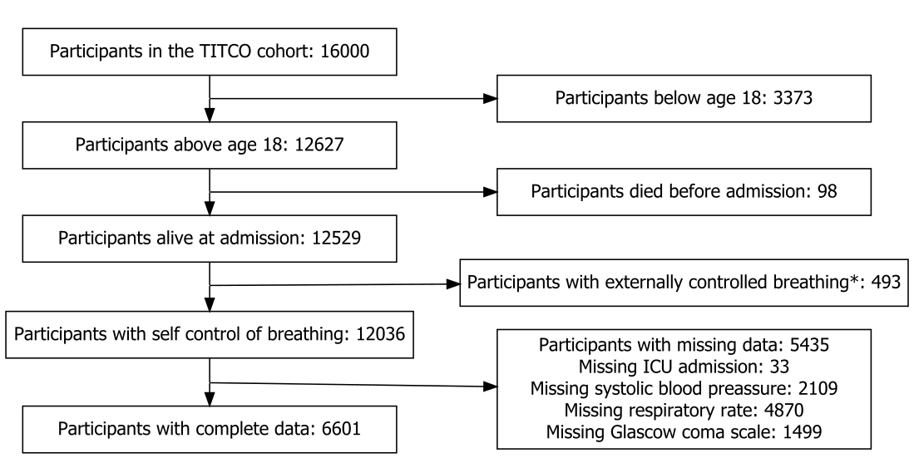

<!-- subtitle: Add a Subtitle if Needed --> 

Introduction 
============
Trauma is a global health problem affecting at least 520 million people per year
[@James2020]. Trauma accounts for 13% of total disability adjusted life years
lost and 8% of deaths globally with the majority in low and middle income
countries [@GBD2017DALY;@Mock2012]. Most deaths from trauma occur shortly
after the injury and reducing mortality in patients with severe trauma requires
early intervention, often due to extensive bleeding for which surgery is vital
for hemorrhage control [@King2019]. After severe trauma patients often need to
be managed in the intensive care unit (ICU) to maintain adequate physiological
functions.

Because of the urgency and complexity of trauma care it is important to early
assess trauma severity to guide further management, including the need for care
in the ICU. Several trauma severity scores have been developed for this purpose,
of which the Revised Trauma Score (RTS) is the most well known
[@Champion1989]. The RTS includes Glasgow come scale (GCS), systolic blood
pressure (SBP) and respiratory rate (RR), and is rated 0-4 points on each
parameter. Because of the multiple cutoffs involved for each parameter the RTS
can be too complex for routine use, especially in low resource settings with
high trauma loads.

The quick Sequential Organ Failure Assessment score (qSOFA score) was developed
in 2016 and includes the same variables as RTS but with just one cutoff for each
parameter. It was introduced as a screening tool coupled with the already
existing Sequential Organ Failure Assessment score (SOFA score). The qSOFA score
was meant to be used bedside to identify patients with high-risk of organ
dysfunction due to infections [@David2017;@Shankar2016] and the SOFA score to
more precisely evaluate the level of organ dysfunction [@Lambden2019]. The
qSOFA score has lately been to be able to predict mortality in trauma patients
[@Miyamoto2019; @Miyamoto2020].

The majority of the research done on trauma and trauma care is from high income
counties and has studied the predictive power of qSOFA on mortality.
Because low resource settings are disproportionately affected by trauma and have
limited resources a simple scoring system to help prioritize resources such as
ICU beds is important. qSOFA is easy to perform and because of its singular
cutoffs is easy to calculate. Therefore we aimed to asses the validity of qSOFA
in predicting ICU admission in trauma patients admitted to hospitals in a low
resource setting and to investigate whether the qSOFA model could be updated to
increase its performance.

Methods
=======

## Source of data

We analysed the Towards Improved Trauma Care Outcomes (TITCO) in India cohort
[@TITCO]. The TITCO cohort data was collected between July 2013 and December 2015 and
includes patients admitted to four public university hospitals. The hospitals
included were; Jai Prakash Narayan Apex Trauma Center, connected to the All
India Institute of Medical Sciences in New Delhi, a large center solely
dedicated to trauma care; King Edward Memorial hospital in Mumbai, a tertiary
level hospital but without dedicated trauma wards; Lokmanya Tilak Municipal
General Hospital in Mumbai, a tertiary level public university hospital with a
smaller dedicated trauma ward; and Seth Sukhlal Karnani Memorial Hospital in
Kolkata, connected to The Institute of Post Graduate Medical Education and
Research, a tertiary level public university hospital without a ward dedicated
solely to trauma.

All data was collected using one dedicated data collector at each site that
rotated between day, evening, and night shifts. The data collectors were not
employed by the hospitals to ensure nonbiased reporting, and all collectors had
a master’s degree in health science as well as they got continuous training and
supervision throughout the study. Data was gathered retrospectively within days
from patients’ case files when not directly observed by a data collector on
site. To ensure consistency the data was reviewed against patients’ files.

## Participants

The TITCO cohort includes patients with a history of trauma who either got
admitted to one of the participating hospitals or who died between arrival and
admission. Patients were not included if they presented with isolated limb
injuries without associated vascular damage or if they were dead upon arrival.
The exclusion criteria for this study where patients below the age of 18,
patients who died before admission to a participating hospital, patients who
arrived with a surgical airway or who were intubated before arriving to a
participating hospital.

## Outcome

The outcome of interest was admission to the ICU during hospitalization as
recorded in the TITCO database. This was recorded as hours in intensive care in
the TITCO database and was for this study converted into a binary variable
representing the presence or absence of ICU admission.

## Predictors

The predictors used in qSOFA are RR, GCS and SBP. Data on these predictors were
collected on arrival to hospital. In the original qSOFA these predictors were
dichotomized using the cutoffs higher than or equal to 22 for respiratory rate, less than 15 for the Glasgow
coma scale, and less than 100 for systolic blood pressure. Using these dichotomized
predictors qSOFA can be expressed as either a model, in which the coefficients
associated with each predictor are used to estimate patient specific
probabilities of the outcome, or a score equal to the sum of the dichotomized
predictors ranging from 0 to 3. For this study we used the predictors as
dichotomized in the original qSOFA publication [@Shankar2016] but also as
continuous variables to identify new optimal cutoffs and associated
coefficients, see Statistical analysis methods below.

## Sample size 
We included all eligible patients from the TITCO cohort

## Missing data
A complete case analysis was conducted. 


## Statistical analysis methods
We used R for all statistical analyses <!--[@Rstudio]-->. We described the sample
characteristics using counts and percentages for qualitative variables and mean
and standard deviations (SD) for quantitative variables. We use model to denote
the combination of predictor values and coefficients that can be used to
estimate patient specific outcome probabilities and score to denote the sum of
dichotomized predictor values.

The study sample was randomly split into three parts called the training sample,
validation sample, and test samples with 60%, 20%, and 20% of the observations in
each sample respectively. To update qSOFA we first used the training sample to
identify new optimal cutoffs for each predictor. To identify optimal cutoffs we
calculated the Youden index for all possible cutoffs for each predictor. We then
defined the optimal cutoff for each predictor as the cutoff that maximized the
Youden index. We then used lostistic regression in the validation sample to
estimate coefficients associated with the new optimal cutoffs.

We used the test sample to assess and compare the performances of the original
and the updated qSOFA models. We assessed performance in terms of
discrimination, as the area under the receiver operating characteristics curve
(AUC), and calibration, as the integrated calibration index (ICI). For AUC, an
acceptable performance is above 0.7 where higher AUCs correspond to better
discrimination and values below 0.7 show poor discrimination. Regarding ICI no
standard for performance exists, but a lower index close to 0 corresponds to a
better calibration. We compared the performances of the original and updated
qSOFA models by calculating the absolute differences in performance estimates.

We also compared the performance of original and updated qSOFA scores. In the
original qSOFA publication [@Seymour2016], odds ratios were only presented for
the individual dichotomized predictors. We used those odds ratios, together with
the presented mortality for patients with a score of 0, to construct a model and
calculate the odds ratios for each level of the score (i.e. 0, 1, 2 and 3) by
averaging the predicted probabilities of the outcome in all patients in the
validation sample with the same score. We calculated the odds ratios associated
with each level of the updated score using the same method and tabulated the
odds ratios of the original and updated scores side by side.

To estimate 95% confidence intervals (CIs) associated with new optimal cutoffs,
performance estimates, differences in performance estimates, and odds ratios for
score levels we used an empirical bootstrap procedure with 1000 iterations.
During each iteration, the entire study process – from splitting of the sample
into training, validation, and test samples to the calculation of score level
odds ratios – was repeated in a bootstrap sample of the same size as the
original sample drawn with replacement.

Results
========
The TITCO cohort included `r results$n.cohort` patients (Figure 1). We excluded
`r results$n.younger.than.18` patients because they were under the age of 18 and
`r  results$n.incl2 ` patients because they died between arrival and admission.
Patients with on arrival externally controlled breathing, such as intubation or
surgical airway, were also excluded accounting for
`r results$n.intub.or.saw.before.arrival` patients. We further excluded
`r results$n.NA_TOT` patients due to missing data in either admission to the ICU
(`r results$n.NA_ICU`), systolic blood pressure (`r results$n.NA_SBP`),
respiratory rate (`r results$n.NA_RR`), or GCS (`r results$n.NA_GCS`). The final
sample included `r results$n.complete` patients. 

```{r figone, fig.align = 'center', out.width = "100%", fig.cap = "Flowchart showing the exclussion criteria andthe number of study participants. /n *Externally controlled breathing includes intubation orsurgical airway before arrival to a participating hospital", echo = FALSE}

```

The mean age was `r round(tabOne$ContTable$Overall["Age","mean"],2)` with
predominantly `r tolower(most.common.sex)` participants (`r p.sex`%). The most
common type of injury was `r tolower(most.common.mechanism)`s with
`r p.mechanism`% followed by `r tolower(second.most.common.mechanism)`s and
`r tolower(third.most.common.mechanism)` accounting for `r p.mechanism.second` %
and `r p.mechanism.third` % respectively. `r  p.transported`% of patients were
transported to a participating hospital from another health care facility.
Overall `r p.ICU`% of patients had to be treated in the ICU. The data is
presented in \@ref(tab:table1) with corresponding standard deviations and
percentages. 


```{r table1, echo = FALSE}
 kableone(tabOne,caption = "Characteristics of the study population, both overall and stratified by ICU admission. SD- Standard deviation.", label = "table1")
```


We identified the following revised optimal cutoffs:
`r boot.cis$cut.sbp[["pe"]]` for SBP, `r boot.cis$cut.rr[["pe"]]` for RR and
`r boot.cis$cut.gcs[["pe"]]` for GCS. We also identified corresponding ORs where
GCS had the highest OR and SBP had the lowest OR. Table 2 presents the cutoffs
and ORs as well as corresponding confidence intervals for the updated model
together with the cutoffs, ORs and confidence intervals for the original model
as taken from the original qSOFA publication.


|           |Original cutoff | Original OR     | Updated OR(95%CI)         | Optimal cutoffs (95%CI) |
|-----------|----------------|----------------|---------------------------|-------------------------|
| Intercept | -    | 0.01*           |  `r ors[["(Intercept)"]]`   |  -                      |
| SBP       | <100 |2.61(2.40-2.85) | `r ors[["new.sbp_score"]]` |`r CIs$cut.sbp`          |
| RR        | >22  | 3.18(2.89-3.50) | `r ors[["new.rr_score"]]`  |`r CIs$cut.rr`           |
| GCS       | <15  |4.31(9.96-4.69) | `r ors[["new.gcs_score"]]` |`r CIs$cut.gcs`          |
Table: Table 2 Overview of the original and updated model. Original and updated odds ratios (OR) for the logistic regression models as well as the cutoffs for each parameter for the original and updated model. The ORs describe the change in odds associated with a predictor value above or below the corresponding cutoff as appropriate.
Abbreviations: OR-Odds ratio, CI-Confidence interval, SBP-Systolic blood pressure, RR-Respiratory rate, GCS-Glasgow coma scale. 
* OR for the original model refers to mortality.
** OR for the updated model refers to ICU admissions.

The predicted probability of ICU admission and corresponding OR for each score
level given the OR from Table 2 is presented in Table 3 and 4 for the original
and the updated models respectively. The presented ORs are weighted according to
the distribution of the individual parameter scores for each total score as
present in the study population. For the original model, the probability ranges
from `r round(as.numeric(CIs$est.prob.sum.org.none),2)*100 `% to
`r round(as.numeric(CIs$est.prob.sum.org.three,2))*100 `% and for the updated model, the
predicted probability ranges from `r round(as.numeric(CIs$est.prob.sum.new.none,2))*100 `%
to `r round(as.numeric(CIs$est.prob.sum.new.three,2))*100 `% for a score of 0-3.  

| Original score | Estimated probability of ICU admission(95%CI) | Odds ratio(95% CI)          |
|-----------------|-----------------------------------------------|-----------------------------|
| 0               | `r CIs$est.prob.sum.org.none `                | 1                           |
| 1               | `r CIs$est.prob.sum.org.one `                 |`r CIs$est.OR.sum.org.one `  |
| 2               | `r CIs$est.prob.sum.org.two `                 |`r CIs$est.OR.sum.org.two `  |
| 3               | `r CIs$est.prob.sum.org.three `               |`r CIs$est.OR.sum.org.three ` |
Table: Predicted probabilities of intensive care unit (ICU) admission given an original qSOFA score of 0-3 and corresponding odds ratios using 0 as reference.

| Updated score   | Predicted probability of ICU admission(95%CI) | Odds ratio(95% CI)          |
|-----------------|-----------------------------------------------|-----------------------------|
| 0               | `r CIs$est.prob.sum.new.none `                | 1                           |
| 1               | `r CIs$est.prob.sum.new.one `                 |`r CIs$est.OR.sum.new.one `  |
| 2               | `r CIs$est.prob.sum.new.two `                 |`r CIs$est.OR.sum.new.two `  |
| 3               | `r CIs$est.prob.sum.new.three `               |`r CIs$est.OR.sum.new.three ` |
Table: Predicted probabilities of intensive care unit (ICU) admission given an updated qSOFA score of 0-3 and corresponding odds ratios using 0 as reference.

Figures 2 and 3 shows comparisons between the estimated and observed
probabilities for the new and updated model and table 5 compares the performance
in terms of Integrated calibration index (ICI) and Area under the curve (AUC)
for the receiver operating characteristics for the original and updated model.

```{r ICIorg, echo = FALSE}
plot(est.sum.org, obs.sum.org, xlim=c(0,1), ylim=c(0,1),main= "Original qSOFA score", xlab= "Predicted probability", ylab="Observed probability" )
lines(c(0,1),c(0,1))
```
```{r ICInew, echo = FALSE}
plot(est.sum.new, obs.sum.new, xlim=c(0,1), ylim=c(0,1),main= "Original qSOFA score", xlab= "Predicted probability", ylab="Observed probability" )
lines(c(0,1),c(0,1))
```

Table: Table 5. Comparison of performance, in terms of ICI and AUC, between the original and the updated qSOFA model as well as the ICI off the combined score for the original and the updated model.
|              | ICI(95% CI)         | Diff ICI (95% CI)                  | AUC (95%CI)        | Diff AUC                  |
|--------------|---------------------|------------------------------------|--------------------|---------------------------|
| Original qSOFA model | `r CIs$ICI.org`     | -                          | `r CIs$auc.org`    |  -                        |
| Updated qSOFA model  | `r CIs$ICI.new`     | `r CIs$diff.ici.qsofa`     | `r CIs$auc.new`    |`r CIs$diff.auc.qsofa`     |
| Original qSOFA score | `r CIs$ICI.sum.org` | -                          | `r CIs$auc.org.sum`|  -                        |
| updated qSOFA score  | `r CIs$ICI.sum.new` | `r CIs$diff.ici.qsofa.sum` | `r CIs$auc.new.sum`|`r CIs$diff.auc.qsofa.sum` |
Abbreviations: AUC Area under the curve, ICI Integrated calibration index

Discussion
========

<!-- aim and how it went, --->
Our aim was to assess the validity of the original qSOFA in
predicting ICU admission in trauma patients admitted to hospitals in a low
resource setting. We found that in the context of urban Indian hospitals the
original qSOFA score, with its original cutoffs and coefficients, did not
accurately predict ICU admission. The original model underestimated the probability
of ICU admission and a max score of 3 did not result in an increased rate of ICU
admission compared to a score of 0. The AUC for the original and updated model remained
below 0.7 and both models discriminated ICU admission poorly. The updated model
performed only slightly better.
The ICI was high for the original and lower for the updated model and score wich
indicates improved calibration when updating both the model and the score.

<!-- usage and limitation -->

While developing the original qSOFA score as a screening tool for patients with an
increased risk of dying from severe infection it was shown that a low score
of 0-1 corresponded to a mortality of approximately 1-2 percent and that a high
score of 2-3 corresponded to a significantly higher mortality of 7-20 %. When
using the predetermined cutoff value of 2 points this result made the original
qSOFA a useful tool to identify patients with a low risk of dying. On the other
hand the results also allowed for that patients with a higher score could be
more closely monitored and get access to treatment before they potentially
deteriorated.

In contrast, with our updated qSOFA for predicting ICU admission in trauma
patients a low score of 0-1 corresponded to a probability for ICU admission of
`r boot.cis$est.prob.sum.new.none[["pe"]]`-`r boot.cis$est.prob.sum.new.one[["pe"]]`% and
a high score of 2-3 corresponded to a probability of
`r boot.cis$est.prob.sum.new.two[["pe"]]`-`r boot.cis$est.prob.sum.new.three[["pe"]]`
%. This shows that regardless of the score the patients still have a relatively
high risk for ICU admission. Out data showed that a higher score correlates with
a higher risk of ICU admission. However, it is not clear what clinical relevance 
this difference would have in the process of deciding the adequate level of care 
for patients with traumatic injuries.

Although no other studies have been done correlating qSOFA to ICU admission in
low resource settings studies have explored the association between qSOFA and
mortality in high resource settings, both regarding patients with risk for
sepsis [@Seymour2016] and trauma patients [@Miyamoto2020;@Sepsis3]. These
studies show that there is a clear association between qSOFA and mortality.
Comparing these results to ours the ORs are higher, and the AUC shows a slightly
better discrimination for mortality than ICU admission. 

It can be argued that both ICU admission and mortality results from a more
severe patient condition, and thus should be correlated. However, in this cohort
mortality was high also in patients who were not admitted to the ICU, indicating
that the association between trauma severity and ICU admission may be less
straightforward in this setting compared with many high resource settings. This
could be partly because these patients were so severely injured that they either
died before they could be transferred to the ICU or it was decided that
intensive care would not be of use for the patients. But it could also be due to
a lack of ICU beds in the participating hospitals such that patients had to be
prioritized for intensive care and not all patients who would benefit from it
got admitted to the ICU. For context, the number of ICU beds per 100 000 people
is 2.3 in India compared with for example 7.3 in Japan [@phua2020]. To be able
to explore this question more thoroughly further research is needed.

Our results also showed that out of the three parameters, the association
between respiratory rate and a higher risk of ICU admission was not
statistically significant. In contrast the associations for SBP and GCS were
statistically significant. This can be partially explained by that a new cutoff
was calculated for each bootstrap resulting in different cutoffs being used
while evaluating the model widening the confidence intervals. It also shows that
in some bootstraps, a higher RR above the cutoff was associated with a lower
risk for ICU admission, suggesting that the connection between RR and ICU
admission is not strictly positive, as assumed in the construction of the qSOFA
model. One possible explanation is that the non-linear association between 
RR and poor outcomes is not captured when a single cutoff is used. More research 
is needed to further explore the connection between RR
and ICU admission before the original, or an updated qSOFA score as presented in
this study, can be used in clinical decision making in this context.

<!-- Strengths and limitations-->

The study had several limitations. First the data collected for the TITCO
database came from a homogeneous group of participating hospitals all in urban
India. Because of this it is unclear if the results are generalizable to for
example rural hospitals.

Secondly it should be noted that 61 percent of the patients where for an
unspecified time first treated at another hospital or health care facility and
then later transferred to one of the participating hospitals. Because of this
the parameters used in this study only show the first ones taken at arrival to
the participating hospital and not always the first ones taken after the injury.
Furthermore, the results in this study do not take into account any
interventions performed before arrival or between arrival and admission to the
ICU.

Lastly the TITCO database had a significant amount of missing data, about 45% of
the 12 thousand participants fulfilling the inclusion criteria were excluded due
to missing data. Since we do not know the distribution, the cause of this
missing data nor whether it can be assumed to have any particular distribution
this further increases the uncertainty. The largest contributor of missing data
was respiratory rate and since this was manually calculated by hospital staff it
is possible that it was not prioritized for patients with the most severe
trauma where other interventions where of greater importance and thus
excluding them from this study. It is unknown if this had any effect on this
study and for more certain result more research is needed.

##Conclusion

This study indicates that qSOFA should not be used to predict ICU admission in
trauma patients in this context. Although an updated qSOFA score can be used 
to estimate the overall risk for ICU admission in trauma patients in urban
Indian hospitals and the updated model had a good calibration on
group level, the discrimination was shown to be too low to merit any use in 
clinical decision making for the individual patient and thus more research is needed. 

