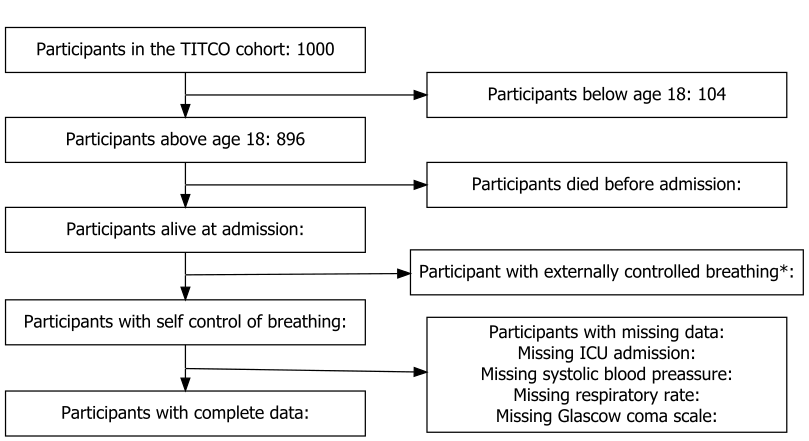

Introduction 
============
Trauma is defined as the clinical entity composed of both physical injury and the body’s associated response. [MeSH] Trauma patients are a heterogenous group with wide range of different causes where some of the most prominent ones are traffic related injuries, falls, self-harm, interpersonal violence and burns. It is a global health problem and the total number of injuries is estimated to be at least 520 million cases per year. [@James2020] The effects of trauma on patients and their families can be divided into non-fatal and fatal trauma.

The effects of non-fatal trauma can be subdivided into Disability Adjusted Life Years (DALY) lost and economical effects. DALY is a measurement using both the mortality in years lost between death and mean age and morbidity as in years lived with reduced function due to the disease. In 2017 trauma accounted for 13% of total DALY lost. [@GBD2017DALY] The economic effects in turn regards both the out of pocket expenses for treatments as well as reduced productivity due to reduced ability after the injury. A study in northern India from 2019 calculated that 22% of patients who presented with traumatic injuries afterward had 30% or more of their total expenditure on healthcare related costs and 12 % were pushed below the international poverty line as a consequence. [@Prinja2019]

Regarding the effect of traumatic injuries on mortality in 2017 trauma accounted for 8% of total global deaths. [@GBD2017DALY] According to calculations done by Mock et al. [@Mock2012] 90% of all deaths due to trauma were in low and middle income countries which also had a fatality rate 60-80% higher than that of high income countries and an improvement in trauma care globally to the level of that in high income countries could save about 1.7 lives annually, or about one third of the global deaths due to trauma.

It is known that most fatalities in response to traumatic injuries occur shortly after the injury and in order to reduce the mortality in patients with severe trauma it requires early intervention, often surgical, as by “the golden hour” concept. This is often due to patients suffering from internal and external bleeding where surgery is an important part of the hemorrhage control. [@King2019] It is evident that in parts of the world with fewer hospitals, reduced access to healthcare and a less developed ambulance networks the time parameter is one of the contributing factors to the difference in increased mortality as mentioned. 

For patients with severe infections the Sequential Organ Failure Assessment (SOFA) score was developed in 1994 to grade the level of organ dysfunction in critically ill patients. The SOFA score is based on the reduced function scored 0-4 for each of the respiratory, cardiovascular, neurological, hepatic, coagulation and renal systems. Initially the focus was mainly patients suffering from severe infections and sepsis, but it was early recognized to be applicable in a wide range of critical illnesses. [@Lambden2019] 

Alongside the last revision of the sepsis definition in 2016 the quick Sequential Organ Failure Assessment score (qSOFA score) was developed. The qSOFA score includes three parameters: Systolic blood pressure (SBP) below 100 mmHg, a respiratory rate (RR) above 22 min and an altered consciousness, measured with a Glasgow Coma Scale (GCS) score below 15. One point is awarded for each parameter yielding a total score of 0-3. Introduced as a screening tool, to be performed bedside to identify patients with high-risk of organ dysfunction due to infections. [@David2017],[@Shankar2016] It has lately also shown ability to predict mortality in patients with traumatic injuries when used both in prehospital care [@Miyamoto2019] as well as repeated evaluation during hospitalization [@Miyamoto2020].

Another tool to assess the severity of a patient’s condition due to trauma is the Revised Trauma Score (RTS) and the Triage Revised Trauma Score (T-RTS) composed of the same parameters as qSOFA, that is GCS, SBP and RR but with a score of 0-4 for each parameter instead of a single criteria. The scores can either be presented individually as used in RTS or added together to a total of 0-12 used in the T-RTS. The RTS thought of to be used in outcome evaluation and assessment of injury severity and the T-RTS for triage and finding patients a prehospital or initial setting in most need of specialized trauma care [@Champion1989] However there are some articles raising concerns about the sensitivity of the T-RTS depending on the type of injury. [@Giannakopoulos2011],[@Alvarez2016]

Because of the inherent urgency and complexity in trauma care it is vital to have an initial scoring system that is both simple to perform and that does not need laboratory nor other advanced measuring equipment. For this reason, the SOFA score can be said to use too advanced techniques and the T-RTS with its many subdividing cut-offs to be too complicated. The choice of using qSOFA is thus because of its promising signs in other studies and because of the possible clinical advantage in its simplicity.  

It should also be noted that the majority of the research done on the topic of trauma and trauma care has been performed in high income countries. It is thus not clear if the results are also applicable in low resource settings, which arguably stand to benefit the most of a scoring system to be able to prioritize the limited resources at hand. Furthermore, most studies report the predictive power of different scoring systems on mortality and it has not yet been sufficiently studied whether an initial qSOFA score can be used to predict admissions to an intensive care unit and thus aid in the direct clinical treatment of trauma patients.

## Aim
The aim of this project is to assess the validity of qSOFA in predicting ICU admission in trauma patients admitted to hospitals in a low resource setting using data from the TITCO cohort [TITCO].


Methods
=======

## Source of data

<!-- 
4a) Describe the study design or source of data (e.g., randomized trial, cohort, or
registry data), separately for the development and validation data sets, if applicable
4b) Specify the key study dates, including start of accrual; end of accrual; and, if
applicable, end of follow-up. 

This study involved an analysis of the observational cohort Towards Improved Trauma Care Outcomes in India (TITCO), for which data were collected before the conception of this study. Ethics committees at all participating centres approved the collation of the database and granted a waiver of consent for patients with trauma (Lokmanya Tilak Municipal General Hospital, IEC/11/13; King Edward Memorial Hospital, IEC(I)/OUT/222/14; Seth Sukhlal Karnani Memorial Hospital, IEC/279; All‐India Institute of Medical Sciences, IEC/NP‐279/2013 RP‐01/2013). The study was conducted using anonymized data, and was registered at ClinicalTrials.gov (NCT03069755) before the research was undertaken.

-->

We conducted a retrospective analysis of the observational Towards Improved Trauma Care Outcomes in India (TITCO) cohort [@TITCO] <!-- TITCO collaborators (2017). TITCO dataset version 1. Available from https://github.com/titco/titco-I. (Behöver läggas in i .bib)-->. The data for TITCO was collected during july 2013 to december 2015 and contains patients admitted to four public university hospitals. The hospitals included were; Jai Prakash Narayan Apex Trauma Center (JPNATC), connected to the All India Institute of Medical Sciences in New Delhi, a large centre soley dedicated to trauma care; King Edward Memorial hospital (KEM) in Mumbai, a tertiary level hospital but without dedicated truma wards; Lokmanya Tilak Municipal General Hospital (LTMGH) in Mumbai, a tertiary lever public university hospital with a smaller dedicated truma ward; and Seth Sukhlal Karnani Memorial Hospital (SSKM) in Kolkata, connected to The Institute of Post-Graduate Medical Education and Research, a tertiary level public university hospital without a ward dedicated soley to trauma.


## Participants
<!-- 
5a) Specify key elements of the study setting (e.g., primary care, secondary care,
general population) including number and location of centres. [D;V]
5b) Describe eligibility criteria for participants. [D;V]
5c) Give details of treatments received, if relevant.  [D;V]
Patients included in the TITCO cohort were those presenting to one of the participating centres with traumatic injury following a transport accident, fall, assault, self‐harm or burn, and who were alive on arrival and admitted to the hospital for treatment. Patients with an isolated limb injury were excluded from the database as such patients are treated by orthopaedic surgeons and not within trauma care pathway, which comprises a first survey done by a surgical resident with an on‐call consultant surgeon and subsequent observation or surgery. Patients from the TITCO cohort who were aged 15 years or older and underwent surgical intervention within 24 h of arrival were included in this study.
-->

The TITCO cohort include patients with a history of trauma who either got admitted to one of the participating hospitals or who died between arrival and admission. Patients with isolated injurys to limbs and that therefore were treated by orthopaedics and not within the general trauma care were excluded from the database alwell as patients who were dead on arrival.  __Do i have any further exclussion criteria? age? type of injury?__ <!-- Look at the qSOFA publication to see if there are any age criteria there. If there were then I suggest we use the same. -- The Sepsis-3 taskforce used criteria of adults, 19 years and older in their meta-analysis, but in most surgical situations adult is from 15 and i would say trauma is mostly surgical?  -->


## Outcome
<!--
6a) Clearly define the outcome that is predicted by the prediction model, including how
and when assessed. [D;V]
6b) Report any actions to blind assessment of the outcome to be predicted. [D;V]
-->
The primary outcome of interest was admission to the ICU during hospitalization. __Any secondary outcomes?__

<!-- Regarding blinding, data on the outcome was collected after data on predictors, i.e. the outcome was not known (in the majority of cases at least, when the predictor data was collected. So in that way the data collectors were "blinded" to the outcome during data collection. So no deliberate action was taken or needed to be taken to avoid bias and therefore nothing should be written about it? -->


## Predictors
<!--
7a) Clearly define all predictors used in developing or validating the multivariable
prediction model, including how and when they were measured. [D;V]
7b) Report any actions to blind assessment of predictors for the outcome and other
predictors. [D;V]
-->
For each patient included in the study the qSOFA score was calculated using data recorded on arrival to the hospital. The calculation of the qSOFA score includes a respiratory rate above 22, GCS below 15 and a systolic blood pressure below 100 where one point is awarded for meeting each of the specified criterias and thus yields a score of 0 to 3. 

## Sample size
<!--
8) Explain how the study size was arrived at [D;V]
-->

We included all eligible patients in the TITCO cohort. <!-- Should this be justified in any way that we found this to be a suffient amount of datapoints for our aim? should we later add how many that turned out to be?-->

## Missing data
<!--
9) Describe how missing data were handled (e.g., complete-case analysis, single
imputation, multiple imputation) with details of any imputation method. [D;V]
-->

<!--
To adress missing data multiple imputation was used. __How specific should this description be? should there be an explanation on how many regressions where used and the size of the random samples yielding the regressions? programs used? Are there any protocols thats usualy used that i can refer to? i know roughly what multiple imputation is but no idea how to implement it...__ 
-->
<!-- Multiple imputation is quite advanced so I suggest we use a complete case analysis, i.e. we exclude patients with missing data-->
<!-- 


## Statistical analysis methods
<!--
10c. For validation, describe how the predictions were calculated. [V]
10d) Specify all measures used to assess model performance and, if relevant, to
compare multiple models [D;V]
10e. Describe any model updating (for example, recalibration) arising from the validation, if done. [V]
-->

We used R for all statistical analysis [RStudio]. We describe the sample characteristics using counts and percentages for qualitative variables and medians and interquartile ranges (IQR) for quantitative variables. The study sample was randomly split into training, validation, and test samples with 60%, 20%, and 20% of the observations in each sample respectively. We used the training sample to update qSOFA by reestimating the coefficients of the original predictors using logistic regression. We used the validation sample to identify optimal cutoffs - those who maximised the Youden index - for the original and updated qSOFA. We used the test sample to assess and compare the performance of the two models. Bootstrapping was used to estimate 95% confidence intervals associated with point estimates. 

<!-- Read other prediction model papers as well as methodological guides to see what domains of predictive performance that we want to look at -->

Från PPF "This will be a retrospective analysis of a cohort of trauma patients admitted to four public university hospitals in urban India between 2013 and 2015. The complete cohort includes 16 000 patients. The primary outcome will be ICU admission. The predictors included in qSOFA are respiratory rate, Glasgow coma scale, and systolic blood pressure. Validity will be assessed in terms of predictive performance, which in turn will be measures as discrimination and calibration. Calibration will further be visualised using calibration plots. An optimal cutoff will be identified using the Youden index and sensitivity, specificity, precision, recall, positive and negative predictive values will assessed at this cutoff. The original model will finally be compared to a updated model, using the same predictive performance measures. Updating will be performed using logistic regression. Missing data will be handled using multiple imputation. "


<!--*Refer to the appropriate reporting guideline for details. If you are
developing, updating or validating a clinical prediction model then
use
[TRIPOD](https://www.equator-network.org/reporting-guidelines/tripod-statement/). If
you are conducting an observational study, for example a cohort or
case control study in which you assess associations between some
exposure and an outcome then use
[STROBE](https://www.equator-network.org/reporting-guidelines/strobe/).*-->

Results
========
The TITCO cohort included `r results$n.cohort` patients, from which `r results$n.younger.than.18` where excluded for being under the age of 18 leaving `r results$n.adults`. Next `r results$n.incl2 ` patients died between arrival and admission and where thus excluded from the sample leaving `r results$n.included` patients. Furthermore `r results$n.NA_TOT` patients where excluded due to missing and non recorded data in one of the following categories: 
admission to the ICU: `r results$n.NA_ICU`
Systolic BP: `r results$n.NA_SBP`
RR: `r results$n.NA_RR`
GCS: `r results$n.NA_GCS`
Leaving `r results$n.complete` datapoints to be used in the analysis.

```{r figure1, fig.align = 'center', out.width = "100%", fig.cap = "Flowchart of exclussion from the study", echo = FALSE}

```

Data characteristics can be seen in table \@ref(tab:table1)

```{r table1, echo = FALSE}
 kableone(CreateTableOne(data = data.table1), caption = "Sample characteristics", label = "table1")
```


## Training

Using the training sample the optimal cutoffs for the logistic regression was found maximizing the youden index. The optimal cutoffs where __99 (95%CI), 30(95%CI) and 14(95%CI)__ for SPB, RR and GCS respectively. and the corresponding confidence intervals can be seen in table 2


## Validation

Using the validation sample, new coefficients and odds ratios(OR) was calculated for the updated model using the cutoffs given in the training sample. The odds ratios can be seen in table 2. 

Furthermore the new coefficent and the original coefficent were used to create odds ratios for the original and uppdated qSOFA scores using the distribution in the validation sample and yielded the results given in table 3 and 4 

|           | Original OR | Uppdated OR(95%CI) |
|-----------|-------------|--------------------|
| Intercept | yy          | XX (xx-xx)         |
| SBP       | yy          | xx (xx-xx)         |
| RR        | yy          | xx (yy-yy)         |
| GCS       | yy          | xx (zz-zz)         |
Table: Table 2 Original and uppdated OR for the logistic regression model 

| Uppdated score  | Estimated probability of ICU admission(95%CI) | Odds ratio(95% CI) |
|-----------------|-----------------------------------------------|--------------------|
| 0               | Prob0.new (xx-xx)                             | 1                  |
| 1               | Prob1.new (xx-xx)                             | OR1(y-y)           |
| 2               | Prob2.new (xx-xx)                             | OR2(y-y)           |
| 3               | Prob3.new (xx-xx)                             | OR3(y-y)           |

Table: Table 3 Estimated probabilities of ICU admission given a uppdated qSOFA score of 0-3 and corresponding OR.

| Original score  | Estimated probability of ICU admission(95%CI) | Odds ratio(95% CI) |
|-----------------|-----------------------------------------------|--------------------|
| 0               | Prob0.org (xx-xx)                             | 1                  |
| 1               | Prob1.org (xx-xx)                             | OR1(y-y)           |
| 2               | Prob2.org (xx-xx)                             | OR2(y-y)           |
| 3               | Prob3.org (xx-xx)                             | OR3(y-y)           |

Table: Table 4 Estimated probabilities of ICU admission given a original qSOFA score of 0-3 and corresponding OR.


## Test

Using the test sample to calculate real probabilities of ICU admission and comparing to the estimated ones for the original and updated model. Figure 2? shows a comparison between the estimated and observed probabilities and table 5 compares the ICI original and updated model.

Figure: __FIGURE with 4 figures showing the est prob vs the real prob for new vs org and sum vs individual. possibly with CIs inluded in the graph__


|              | ICI(95% CI) | Diff(95% CI) |
|--------------|-------------|--------------|
| ORG separate | XX (xx-xx)  | -            |
| NEW seperate | xx (xx-xx)  | yy (zz-zz)   |
| ORG sum      | xx (yy-yy)  | -            |
| New sum      | xx (zz-zz)  | yy (zz-zz)   |
Table: caption

